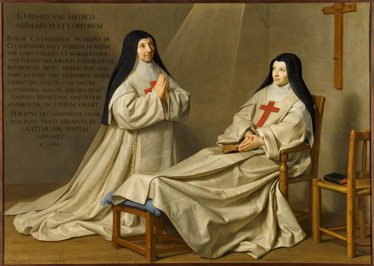

+++
title = "Ex-voto de 1662 ; La Mère Catherine-Agnès de Saint-Paul Arnauld et la Sœur Catherine de Sainte Suzanne de Champaigne"
summary = "Philippe de Champaigne "
read_more_copy = "Voir la fiche"
categories = ["Cisterciennes", "Supérieure", "Simple moniale", "XVIIe siècle"]
index = ["Philippe de Champaigne", "Jean-Baptiste de Champaigne", "Catherine-Agnès Arnauld", "Catherine de Sainte-Suzanne de Champaigne"]
+++

**Titre** : Ex-voto de 1662 ; La Mère Catherine-Agnès de Saint-Paul Arnauld et la Sœur Catherine de Sainte Suzanne de Champaigne

**Auteur principal** : [Philippe de Champaigne](index:Philippe-de-Champaigne) 

**Profession** : Peintre 

**Renseignements biographiques** : Bruxelles 1602 - Paris 1674

**Auteurs secondaires** : [Jean-Baptiste de Champaigne](index:Jean-Baptiste-de-Champaigne) 

**Profession** : Peintre

**Renseignements biographiques** : Bruxelles 1631 - Paris 1681

**Date d'exécution** : 1662

**Lieu d'exécution** : Paris 

**Matériaux/Techniques** : Peinture huile sur toile 

**Dimensions** : 165 x 229 cm

**Lieu de conservation actuel** : Musée du Louvre, département des Peintures. Numéro d'Inventaire : INV 1138.

**Lieu de séjour/d'exposition initial** : Salle du chapitre de l'abbaye de Port-Royal-des-Champs jusqu'en 1709  

**Autre lieu d'exposition** : Abbaye de Port-Royal de Paris

**Ordre** : Cistercien

**Nom du ou des monastères d'exercice** : Abbaye de Port-Royal des Champs

**Nom de la religieuse 1** : [Catherine-Agnès Arnauld](index:Catherine-Agnès-Arnauld)  

**Statut de la religieuse 1** : Abbesse 

**Nom de la religieuse 2** : [Catherine de Sainte-Suzanne de Champaigne](index:Catherine-de-Sainte-Suzanne-de-Champaigne)

**Statut de la religieuse 2** : Simple moniale 

**Texte dans l'image** : "Christo uni medico animarum et corporum / Soror Catharina Susanna de Champaigne post febrem 14 mensium contumacia et magnitudine symptomatum medicis formidatam. Intercepto motu dimidii fere corporis natura iam fatiscente medicis cedentibus junctis cum Matre Catharina Agnete precibus punct (tilde) temporis perfectam sanitatem consecuta se iterum offert. Philippus de Champaigne hanc imacinem tanti miraculi et laetitiae suae testem apposuit. 1662."

**Auteur des textes** : Hamon ou Antoine Arnauld

**Traduction des textes** : « Au Christ, unique médecin des corps et des âmes. La sœur Catherine Suzanne de Champaigne, après une fièvre de 14 mois qui par son caractère tenace et la grandeur des symptômes avait effrayé les médecins, alors qu’était presque paralysée la moitié du corps, que la nature était déjà épuisée et que les médecins l’avaient abandonnées, s’étant jointe avec la mère Catherine Agnès par ses prières en un instant de temps une parfaite santé s’en étant suivie, à nouveau s’offre. Philippe de Champaigne cette image d’un si grand miracle et de sa joie témoin a présenté à côté en l’année 1662. » 

**Auteur de la traduction** : Louis MARIN dans _Philippe de Champaigne ou la présence cachée_, Paris, Hazan, 1995, p.311.

**Commentaires** : Le tableau a été peint par Philippe de Champaigne pour la guérison miraculeuse de sa fille, sœur professe de l'abbaye, grâce au reliquaire qu'elle a sur les genoux. L'auteur du texte de l'inscription est soit le médecin de Port-Royal, Hamon, soit Antoine Arnauld. Elle est tracée par le neveu du peintre, Jean-Baptiste Champaigne. Le tableau est visible sur les gravures de Madeleine Horthemels et les gravures anonymes représentant le chapitre.
Le tableau a appartenu au cardinal de Noailles.
Saisie révolutionnaire attribuée au Louvre en 1793.

**Crédits photographiques** : © Réunion des musées nationaux-Grand Palais (musée du Louvre) / Franck Raux. Cote cliché : 07-524396.

**Références bibliographiques** : C.P.I. 111.

Article de Jean Hubac sur la base Palissy.

DORIVAL Bernard, _Philippe de Champaigne (1602-1674) : la vie, l’œuvre et le catalogue raisonné de l’œuvre_,  Paris, Laget, 1976, 2 volumes.

TAPIE Alain et Nicolas SAINTE-FARE GARNOT Nicolas dir., _Philippe de Champaigne (1602-1674). Entre politique et dévotion_, Paris, RMN,  2007.

