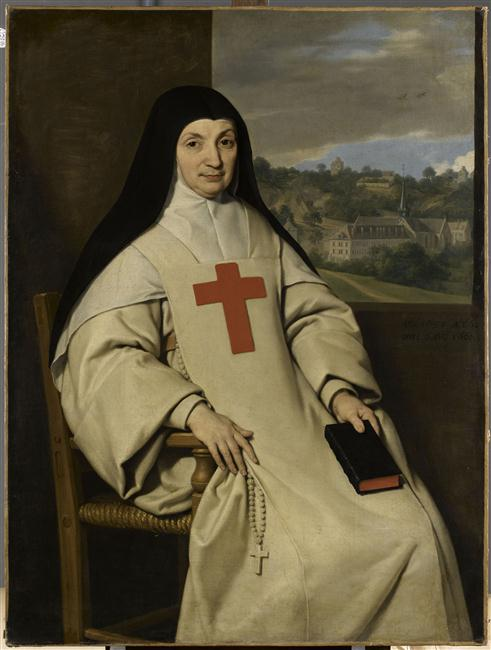

+++
title = "Mère Marie Angélique Arnauld (1591-1661), abbesse de Port-Royal"
summary = "Philippe de Champaigne "
read_more_copy = "Voir la fiche"
categories = ["Cisterciennes", "Supérieure", "XVIIe siècle"] 
index = ["Philippe de Champaigne", "Marie-Angélique Arnauld"]
+++

**Titre** : Mère Marie Angélique Arnauld (1591-1661), abbesse de Port-Royal

**Auteur principal** : [Philippe de Champaigne](index:Philippe-de-Champaigne) 

**Profession** : Peintre 

**Renseignements biographiques** : Bruxelles 1602 - Paris 1674

**Date d'exécution** : 1654

**Lieu d'exécution** : Abbaye de Port-Royal des Champs

**Matériaux/Techniques** : Peinture huile sur toile 

**Dimensions** : 130 x 98 cm

**Lieu de conservation actuel** : Musée du Louvre, département des peintures. Numéro d'inventaire : RF 2035.

**Lieu de séjour/d'exposition initial** : Abbaye de Port-Royal des Champs

**Ordre** : Cistercien

**Nom du ou des monastères d'exercice** : Abbaye de Port-Royal des Champs

**Nom de la religieuse** : [Marie-Angélique Arnauld](index:Marie-Angélique-Arnauld) 

**Statut de la religieuse** : Abbesse

**Texte dans l'image** : "ANNO 1654 Act 62. Obijt 6 Aug 1661"

**Traduction des textes** : "En l'an 1654, à l'âge de 62 ans. Elle mourut le 6 août 1661"

**Auteur de la traduction** : Lydie Brunetti

**Commentaires** : Anciens propriétaires : comte de Rouze, Mme de Nolleval. Legs de Mme de Nolleval en 1905, remis par sa nièce, Mme de Rochambeau, en 1909. D'abord en dépôt à Port-Royal-de-Paris, puis au musée du Louvre. 

**Crédits photographiques** : © Réunion des musées nationaux-Grand Palais (musée du Louvre) / Tony Querrec. Cote cliché : 11-542067.

**Références bibliographiques** : STERLING Charles, _Musée du Louvre : catalogue illustré des peintures : école française XVIIème et XVIIIème siècles_, 1974, N°106 .

