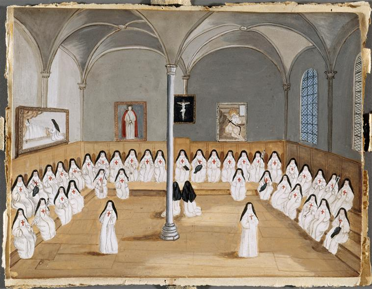

+++
title = "Chapitre des religieuses à Port-Royal-des-Champs"
summary = "Madeleine Boullogne "
read_more_copy = "Voir la fiche"
categories = ["Cisterciennes", "Supérieure", "Simple moniale", "XVIIe siècle", "XVIIIe siècle"]
index = ["Madeleine Boullogne"] 
+++

**Titre** : Chapitre des religieuses à Port-Royal-des-Champs

**Auteur principal** : [Madeleine Boullogne](index:Madeleine-Boullogne) 

**Profession** : Peintre 

**Renseignements biographiques** : 1646 - 1710

**Date d'exécution** : Fin XVIIème / début XVIIIème siècle

**Lieu d'exécution** : France

**Matériaux/Techniques** : Dessin à la gouache 

**Dimensions** : 15.5 x 12 cm

**Lieu de conservation actuel** : Propriété du Louvre, département des Arts Graphiques. Numéro d'inventaire : RF 6749, recto et MV6001.

**Autre lieu d'exposition** : Château de Versailles ; Musée de Port-Royal des Champs, Magny-les-Hameaux

**Ordre** : Cistercien

**Nom du ou des monastères d'exercice** : Abbaye de Port-Royal-des-Champs

**Nom de la religieuse 1** : Religieuses anonymes

**Statut de la religieuse 1** : Abbesse

**Statut de la religieuse 2** : Simples moniales

**Commentaires** : L'abbesse se tient assise au centre, sur le siège le plus haut. Sur les murs, on remarque plusieurs tableaux : un crucifix, un Ecce Homo (probablement celui de Philippe de Champaigne, peint en 1655 pour l'abbaye), un tableau représentant une religieuse au pied d'un lit (probablement l'ex-voto de Philippe de Champaigne).

**Crédits photographiques** : © Réunion des Musées Nationaux-Grand Palais (musée de Port-Royal des Champs) / Gérard Blot.

