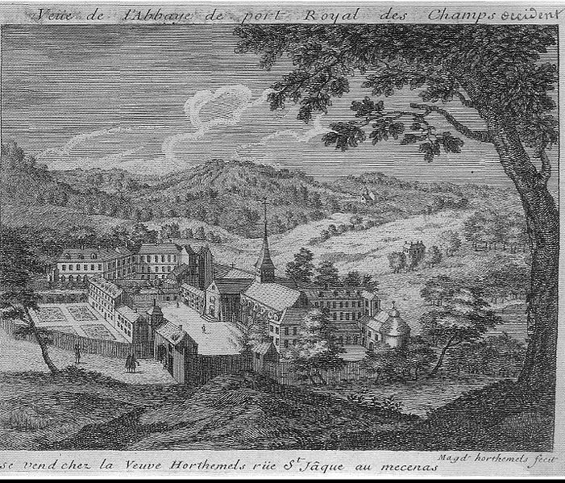

+++
title = "Vue de l'abbaye de Port-Royal des Champs"
summary = "Louise-Magdeleine Horthemels "
read_more_copy = "Voir la fiche"
categories = ["Cisterciennes", "Simple moniale", "XVIIIe siècle"]
index = ["Louise-Magdeleine Horthemels"]
+++

**Titre** : Vue de l'abbaye de Port-Royal des Champs

**Auteur principal** : [Louise-Magdeleine Horthemels](index:Louise-Magdeleine-Horthemels)  

**Profession** : Graveur ; dessinatrice

**Renseignements biographiques** :  Paris 1686 - Paris 1767

**Date d'exécution** : XVIIIème siècle

**Lieu d'exécution** : Paris

**Matériaux/Techniques** : Estampe à l'eau-forte et burin sur papier vergé 

**Dimensions** : 16,8 x 20,4 cm

**Lieu de conservation actuel** : Musée des Beaux-Arts et d'Archéologie de Châlons-en-Champagne. Numéro d'inventaire : 926.5.34 ; 2239 (Registre des entrées (1865-1969)).

**Autres exemplaires** : 2 exemplaires distincts

**Ordre** : Cistercien

**Nom du ou des monastères d'exercice** : Abbaye de Port-Royal des Champs

**Nom de la religieuse** : Religieuses anonymes

**Statut de la religieuse** : Simples moniales

**Paratexte** : "Vue de l'abbaye de Port-Royal des Champs occident"  

"Se vend chez la veuve Horthemels rüe St Jâques au mecenas"

"Magd horthemels fecit".

**Commentaires** : Ancien propriétaire : Gailleur. Acquis en 1926.

**Crédits photographiques** : © Maillot Hervé, musée des beaux-arts et d'archéologie de Châlons-en-Champagne.

