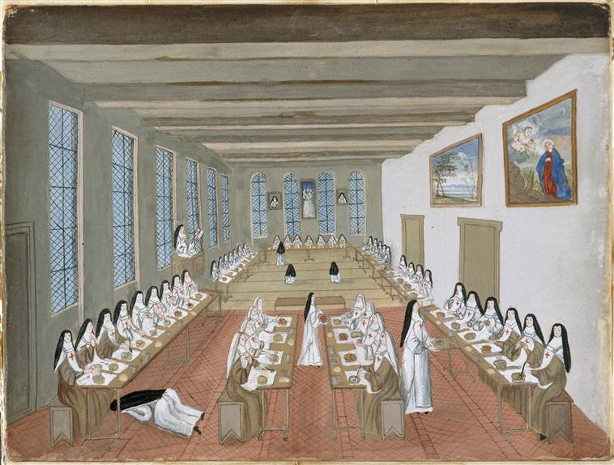

+++
title = "Réfectoire de Port-Royal des Champs"
summary = "Madeleine Boullogne "
read_more_copy = "Voir la fiche"
categories = ["Cisterciennes", "Supérieure", "Simple moniale", "XVIIe siècle", "XVIIIe siècle"]
index = ["Madeleine Boullogne"]
+++

**Titre** : Réfectoire de Port-Royal des Champs

**Auteur principal** : Madeleine Boullogne 

**Profession** : Peintre 

**Renseignements biographiques** : 1646 - 1710

**Date d'exécution** : Fin XVIIème / début XVIIIème siècle

**Lieu d'exécution** : France

**Matériaux/Techniques** : Dessin à la gouache sur parchemin 

**Dimensions** : 12,2 x 16,2 cm

**Lieu de conservation actuel** : Propriété du Louvre, département des Arts Graphiques. Numéro d'inventaire : RF 6752, recto et MV6004.

**Autre lieu d'exposition** : Château de Versailles ; Musée de Port-Royal des Champs, Magny-les-Hameaux

**Ordre** : Cistercien

**Nom du ou des monastères d'exercice** : Abbaye de Port-Royal des Champs

**Nom de la religieuse 1** : Religieuses anonymes

**Statut de la religieuse 1** : Abbesse

**Statut de la religieuse 2** : Simples moniales ; novices ; converses 

**Commentaires** : Les novices en voile blanc sont sur une table centrale. Les converses en habit brun sont au premier plan ; les choristes en habit blanc sont au deuxième plan. Certaines religieuses sont en pénitence (à genoux devant l'abbesse, sous la table). La lectrice se trouve dans une chaire. Plusieurs tableaux sont présents aux murs.

**Crédits photographiques** : © Réunion des Musées Nationaux-Grand Palais (musée de Port-Royal des Champs) / Gérard Blot. Cote cliché : 93-006273-02.

