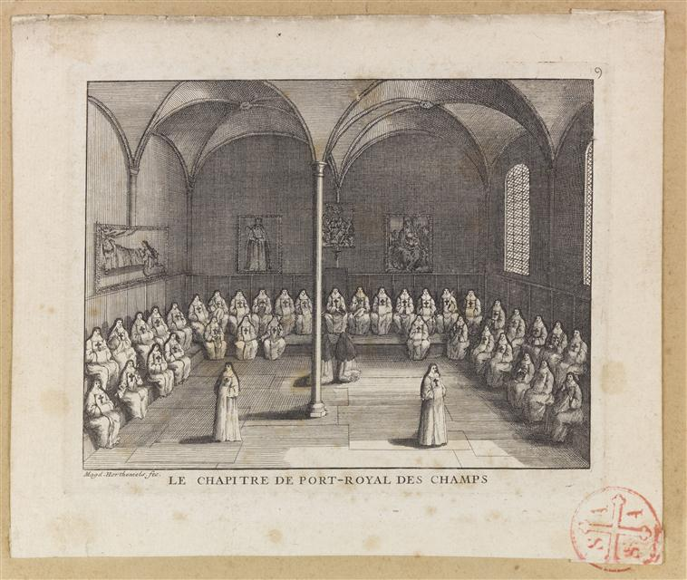

+++
title = "Le chapitre de Port-Royal des Champs"
summary = "Louise-Magdeleine Horthemels"
read_more_copy = "Voir la fiche"
categories = ["Cisterciennes", "Supérieure", "Simple moniale", "XVIIIe siècle"]
index = ["Louise-Magdeleine Horthemels"]
+++

**Titre** : Le chapitre de Port-Royal des Champs

**Auteur principal** : [Louise-Magdeleine Horthemels](index:Louise-Magdeleine-Horthemels)   

**Profession** :  graveur ; dessinatrice 

**Renseignements biographiques** : 1686 - 1767

**Date d'exécution** : Entre février 1710 et juillet 1713

**Lieu d'exécution** : Paris

**Matériaux/Techniques** : Gravure 

**Dimensions** : 13,9 x 17,3 cm

**Lieu de conservation actuel** : Musée de Port-Royal des Champs, Magny-les-Hameaux. Numéro d'inventaire : SPR51.

**Autres exemplaires** : Bibliothèque Nationale de France, département des Estampes et photographies, dans le Recueil _Oeuvre de Magdeleine Cochin Louise-Magdeleine Horthemeis, femme de Charles Nicolas Cochin_, IFF 2, n°AA-3 (COCHIN, LOUISE MADELEINE).

**Inspiration artistique** : D'après le dessin de Madeleine Boullogne

**Ordre** : Cistercien

**Nom du ou des monastères d'exercice** : Abbaye de Port-Royal des Champs

**Nom de la religieuse** : Religieuses anonymes

**Statut de la religieuse 1** : Abbesse

**Statut de la religieuse 2** : Simples moniales

**Paratexte** : "Le chapitre de Port-Royal des Champs" ; "Magd. Horthemels fec"

**Commentaires** : Les tableaux sur les murs sont différents que sur le dessin de Madeleine Boullogne.

**Crédits photographiques** : © Réunion des Musées Nationaux-Grand Palais (musée de Port-Royal des Champs) / Michel Urtado. Cote cliché : 11-541540.

