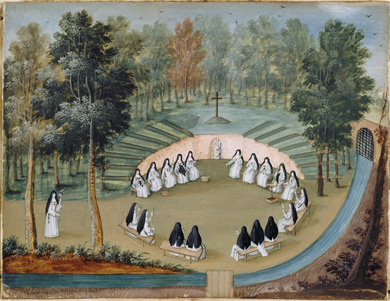

+++
title = "Les Religieuses de l'abbaye de Port-Royal des Champs faisant la conférence dans \"la Solitude\""
summary = "Madeleine Boullogne"
read_more_copy = "Voir la fiche"
categories = ["Cisterciennes", "Supérieure", "Simple moniale", "XVIIe siècle", "XVIIIe siècle"]
index = ["Madeleine Boullogne"]
+++

**Titre** : Les Religieuses de l'abbaye de Port-Royal des Champs faisant la conférence dans "la Solitude"

**Auteur principal** : [Madeleine Boullogne](index:Madeleine-Boullogne)    

**Profession** : Peintre

**Renseignements biographiques** : 1646 - 1710

**Date d'exécution** : Fin XVIIème / début XVIIIème siècle

**Lieu d'exécution** : France

**Matériaux/Techniques** : Dessin à la gouache sur parchemin 

**Dimensions** : 12.2 x 16.2 cm

**Lieu de conservation actuel** : Propriété du Louvre, département des Arts Graphiques. Numéro d'inventaire : MV5999 ; RF 6747, recto.

**Autre lieu d'exposition** : Château de Versailles ; Musée de Port-Royal des Champs, Magny-les-Hameaux

**Ordre** : Cistercien

**Nom du ou des monastères d'exercice** : Abbaye de Port-Royal des Champs

**Nom de la religieuse 1** : Religieuses anonymes

**Statut de la religieuse 1** : Abbesse

**Statut de la religieuse 2** : Simples moniales

**Commentaires** : L'espace de la Solitude existe réellement. On peut le voir sur les plans qui ont été faits de l'abbaye et est encore visible aujourd'hui. Les moniales y travaillent. La Solitude comporte un Calvaire et une statue de la Vierge à l'Enfant.

**Crédits photographiques** : © Réunion des Musées Nationaux-Grand Palais (musée de Port-Royal des Champs) / Gérard Blot. Cote cliché : 93-006268-03.

