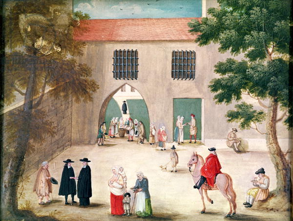

+++
title = "Distribution des aumônes au-dehors de Port-Royal des Champs"
summary = "Madeleine Boullogne"
read_more_copy = "Voir la fiche"
categories = ["Cisterciennes", "Simple moniale", "XVIIe siècle", "XVIIIe siècle"]
index = ["Madeleine Boullogne"]
+++

**Titre** : Distribution des aumônes au-dehors de Port-Royal des Champs

**Auteur principal** : [Madeleine Boullogne](index:Madeleine-Boullogne)    

**Profession** : Peintre

**Renseignements biographiques** : 1646 - 1710

**Date d'exécution** : Fin XVIIème / début XVIIIème siècle

**Lieu d'exécution** : France

**Matériaux/Techniques** : Dessin à la gouache sur parchemin 

**Dimensions** : 12.2 x 16.2 cm

**Lieu de conservation actuel** : En dépôt au Musée national des châteaux de Versailles et de Trianon. Propriété du Louvre, département des Arts Graphiques. Numéro d'inventaire : RF 6754, recto.

**Autre lieu d'exposition** : Déposé à Versailles puis envoyé à Port-Royal (?)

**Ordre** : Cistercien

**Nom du ou des monastères d'exercice** : Abbaye de Port-Royal des Champs

**Nom de la religieuse 1** : Religieuses anonymes

**Statut de la religieuse 1** : Tourières

**Autres personnages religieux** : Ecclésiastiques

**Autres personnages laïcs** : Pauvres gens 

**Commentaires** : Les tourières près de la porte sont réduites à des silhouettes.

**Crédits photographiques** : Château de Versailles, France / Bridgeman Images. IMAGE number : XIR221469.

