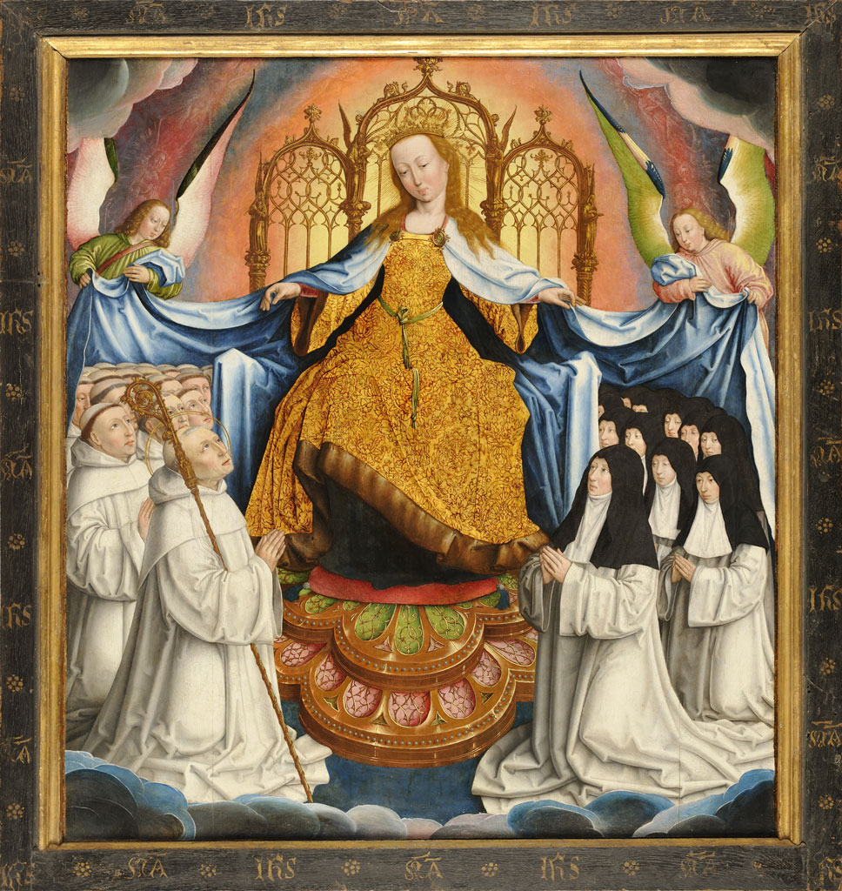

+++
title = "La Vierge protégeant l'ordre de Cîteaux"
summary = "Jean Bellegambe"
read_more_copy = "Voir la fiche"
categories = ["Cisterciennes", "Supérieure", "XVIe siècle"]
index = ["Jean Bellegambe", "Jeanne de Boubais", "Saint Bernard de Clairvaux", "Vierge Marie"]
+++

**Titre** : La Vierge protégeant l'ordre de Cîteaux

**Auteur principal** : [Jean Bellegambe](index:Jean-Bellegambe)    

**Profession** : Peintre

**Renseignements biographiques** : Douai 1470 - Douai 1535

**Date d'exécution** : Première décennie du XVIème siècle (vers 1507-1508)

**Lieu d'exécution** : Abbaye de l'Honneur-Notre-Dame, Flines-lez-Râches.

**Matériaux/Techniques** : Retable ; peinture huile sur bois 

**Dimensions** : 91 x 74 cm

**Lieu de conservation actuel** : Musée de la Chartreuse, Douai. Numéro d'inventaire : INV 408. 

**Lieu de séjour/d'exposition initial** : Abbaye de l'Honneur-Notre-Dame (Flines)

**Ordre** : Cistercien

**Nom du ou des monastères d'exercice** : Abbaye de l'Honneur-Notre-Dame (Flines)

**Nom de la religieuse 1** : [Jeanne de Boubais](index:Jeanne-de-Boubais) 

**Statut de la religieuse 1** : Abbesse

**Nom de la religieuse 2** : Religieuses anonymes

**Statut de la religieuse 2** : Simples moniales

**Autres personnages religieux** : [Saint Bernard de Clairvaux](index:Saint-Bernard-de-Clairvaux) ; [Vierge Marie](index:Vierge-Marie) ; anges

**Texte dans l'image** : "IHS" 

**Commentaires** : Le panneau représentant au recto La Vierge protectrice des Cisterciens et au verso Le Jugement dernier, anciennement attribué à Jan Provost est certainement la table d’autel commandée à Jean Bellegambe pour la chapelle Saint Michel de Flines et payée en 1509 : « Item à la chapelle Sainct Michel pour une très belle table d’autel totalement neuve, dont a esté payé à maistre Jehan Bellegambe, paintre demourant à Douay, plus de 11c livres ». Le panneau de Douai correspond par son iconographie (Le Jugement dernier) à la décoration d’une chapelle dédiée à saint Michel. La représentation de Jeanne de Boubais, abbesse de Flines, et Isabelle de Maléfiance, boursière de l’abbaye confirme l’origine du panneau. Le thème de la Vierge au manteau a été souvent représenté au Moyen-Age dans l’iconographie cistercienne à la suite de la vision de Césaire d’Eisterbach qui vit en songe, sous le manteau de la Vierge, une multitude de moines de l’ordre de Citeaux. Sur le panneau de Douai, sont figurés Bernard de Clairvaux, réformateur de l’ordre et Jeanne de Boubais, abbesse de Flines. Cette iconographie a sans doute été choisie pour marquer la réformation de l’abbaye qui date de décembre 1506. Isabelle de Maléfiance ayant été boursière en 1507, et Jeanne de Boubais, abbesse à partir de 1507, c’est vraisemblablement vers 1507-1508 que l’oeuvre a été exécutée. Il est aussi possible que l'œuvre ait été commandée par Jeanne de Boubais, Isabelle de Maléfiance, les deux conjointement, ou par la communauté dans son ensemble.

Ancienne appartenance : Dr Escallier. Acquis en 1857. 

**Crédits photographiques** : ©Douai, Musée de la Chartreuse

**Références bibliographiques** : LE BRAS Gabriel dir., _Les ordres religieux, la vie et l’art_, Tome 1, Paris, Flammarion, 1979, p.514. 

DONADIEU-RIGAUT Dominique, _Les ordres religieux et le manteau de Marie_, Journal of Médievists and Humanistics Studies. Site du Centre de Recherches Médiévales et Humanistes. 

CAT. 1937 n° 241. Notice : Françoise Baligand.

