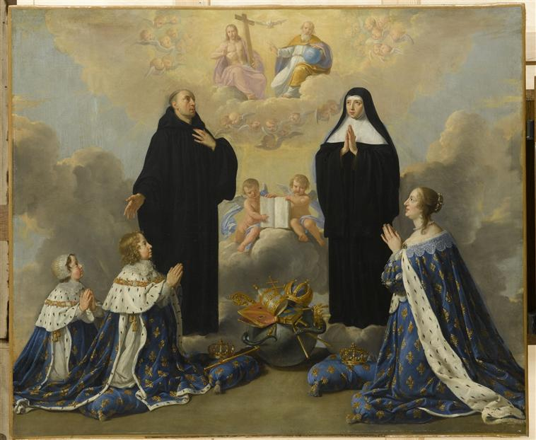

+++
date = '2026-09-13T13:14:59+02:00'
title = "Anne d'Autriche et ses fils priant la Trinité avec saint Benoît et sa sœur Scholastique"
summary = "Philippe de Champaigne"
read_more_copy = "Voir la fiche"
+++

**Titre** : Anne d'Autriche et ses fils priant la Trinité avec saint Benoît et sa sœur Scholastique

**Auteur principal** : Philippe de Champaigne 

**Profession** : Peintre 

**Renseignements biographiques** : Bruxelles 1602 - Paris 1674

**Auteurs secondaires** : Atelier de Philippe de Champaigne

**Date d'exécution** : 1646

**Lieu d'exécution** : Paris

**Matériaux/Techniques** : Peinture huile sur toile 

**Dimensions** : 106 X 138 cm

**Lieu de conservation actuel** : Musée national des châteaux de Versailles et de Trianon. Numéro d'inventaire : MV 3440 ; INV 1168 ; LP 294.

**Lieu de séjour/d'exposition initial** : Appartement d'Anne d'Autriche au Val de Grâce.

**Ordre** : Bénédictin

**Nom de la religieuse 1** : Sainte Scholastique 

**Statut de la religieuse 1** : Abbesse et fondatrice traditionnelle des moniales bénédictines.

**Autres personnages religieux** : Saint Benoît

**Autres personnages laïcs** : Anne d'Autriche ; Louis XIV ; Philippe d'Orléans

**Commentaires** : La commanditaire est Anne d'Autriche pour son appartement au Val-de-Grâce.
La reine Anne d'Autriche et ses enfants Louis XIV et Philippe, duc d'Anjou, sont représentés en prière en grands costumes royaux, présentés par saint Benoît et sainte Scholastique à la Sainte-Trinité.
Ancien propriétaire : Delambre. Acquis en 1833 par le musée national du Château de Versailles.

**Crédits photographiques** : © Réunion des musées nationaux - utilisation soumise à autorisation.
© RMN-Grand Palais (Château de Versailles) / Gérard Blot.
Cote cliché : 06-519213.

**Références bibliographiques** : SOULIE Eudore, Notices du musée national de Versailles, 1re partie : rez-de-chaussée, Paris, C. de Mourgues frères, 1880 (3e éd.). N° 3440. 

CONSTANS Claire, Musée national du château de Versailles, catalogue des peintures, Paris, 1980, n° 762.

HEURTEBIZE Benjamin et TRIGER Robert, Sainte Scholastique, Patronne du Mans, Paris, Impression Saint-Pierre, Solesmes et Victor Retaux, 1897, p.483-484.

